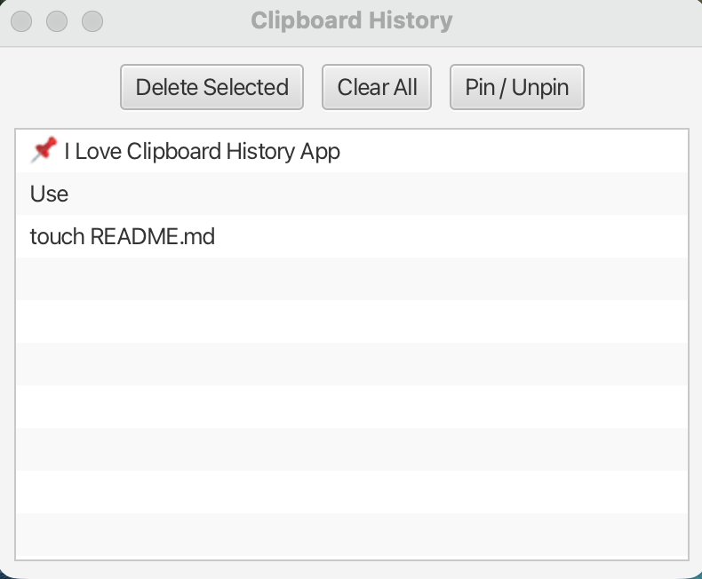

# Mac Clipboard History

A simple JavaFX application for macOS that keeps a history of copied text.

## Features

* Automatically track copied text
* View clipboard history
* Double-click an item to copy it again
* Pin important items
* Delete selected items
* Clear all non-pinned items
* Save and load history locally

## Screenshot



## Run from Source

```bash
mvn javafx:run
```

## Requirements

* Java 21
* Maven

## Download

The packaged application will be available in the Releases section.

## Version History

| Version | Date       | Changes         |
| ------- | ---------- | --------------- |
| v1.0.0  | 2026-06-05 | [Download for macOS](https://github.com/imalsahli/MacClipboardHistory/releases/download/v1.0.0/MacClipboardHistory-1.0.dmg) |

